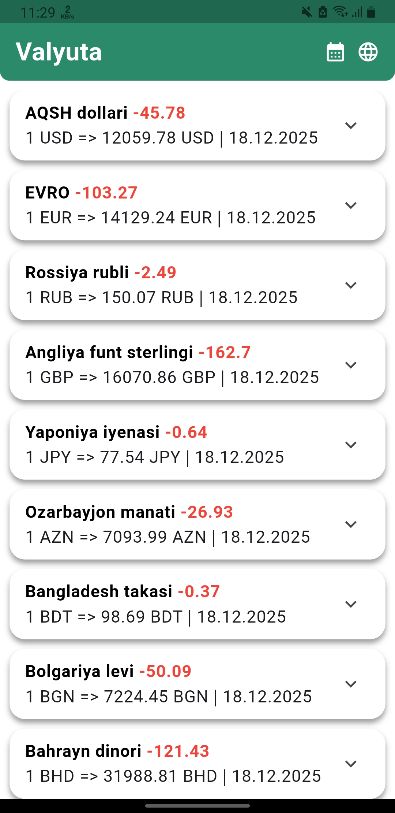
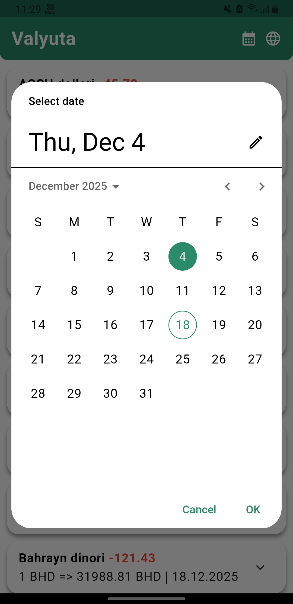
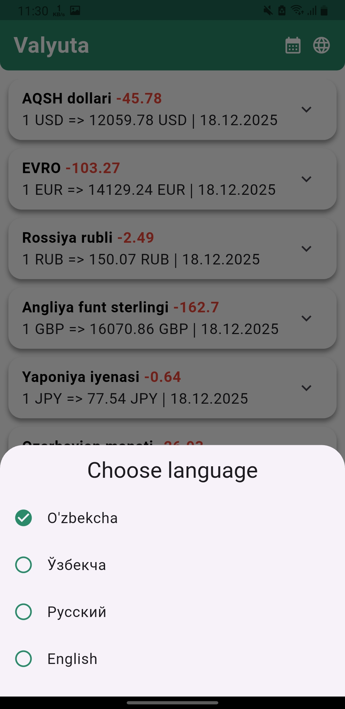
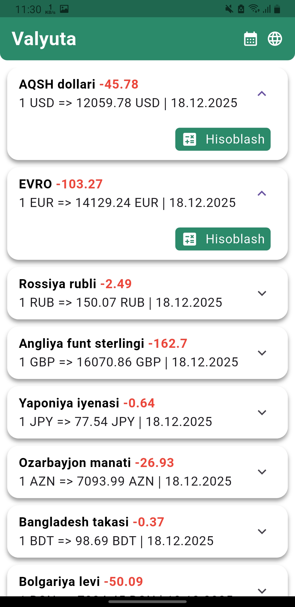
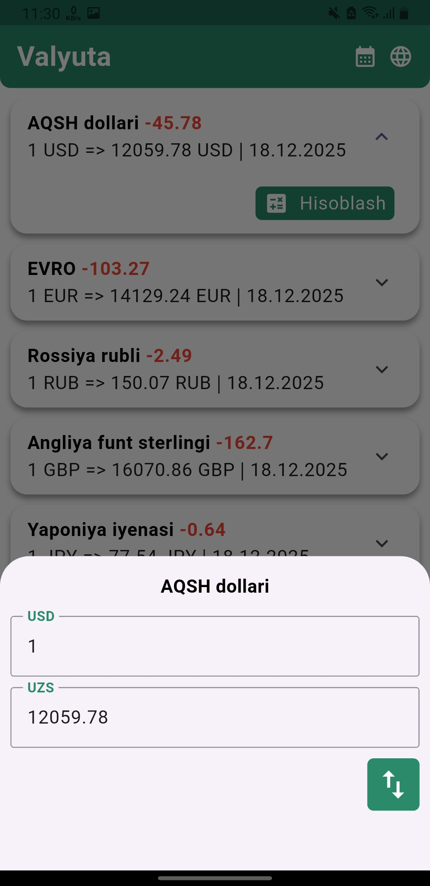

# Currency Converter App

The Currency Converter app is built using Flutter and Dart, providing users with a fast and convenient way to convert between different currencies. The app uses Bloc for state management, ensuring a smooth and responsive user experience.

# 📌 Features:

Live Currency Conversion: Convert currencies in real-time based on user selection.

Historical Rates: View past exchange rates for better insights.

Clean UI: Simple and intuitive interface for easy navigation.

Bloc State Management: Efficiently manage app state and improve performance.

# 🛠 Technologies:

Flutter & Dart: Core technologies for app development.

Bloc: State management solution.

Dio: Fetch currency rates from APIs.

#

  
  
  
  
  

# 🎥 App Preview

# 🚀 Running the Project
Download the APK and try it out.

Author: [Hasanov Jahongir]

Contact: [jahonh959@gmail.com]
